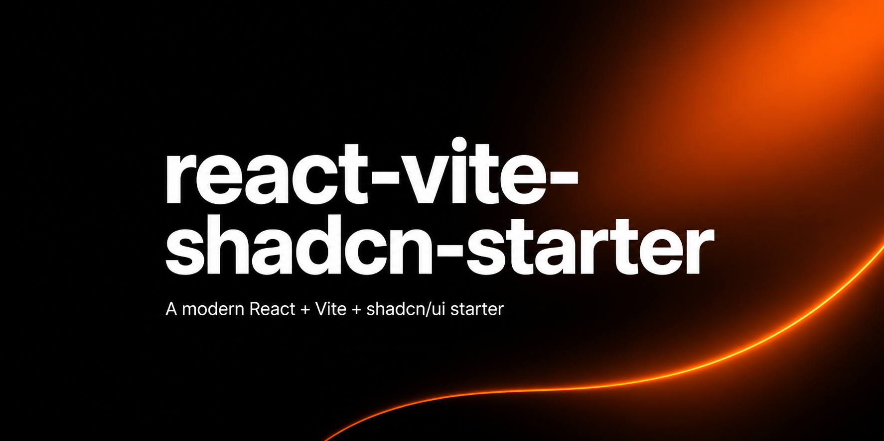

# react-vite-shadcn-starter



An opinionated, production-leaning starter for building authenticated SPAs with **React 19**, **Vite 8**, **TypeScript 6**, **Tailwind CSS v4**, and **shadcn/ui**.

This isn't a "hello world" template — it ships with a four-state auth machine, lazy-loaded routes, a typed API layer, error boundaries, a custom logger, manual bundle chunks, and a test setup. Most of what you'd otherwise wire up by hand on day one is already there.

## What's included

- **React 19** + **TypeScript 6** on **Vite 8** with React Compiler-aware lint rules
- **Tailwind CSS v4** (CSS-first config, no `tailwind.config.js`)
- **shadcn/ui** (`new-york` style, current registry — `data-slot` attributes, no `forwardRef`)
- **Radix primitives** via the unified `radix-ui` package
- **react-router-dom v7** with route-level `<Suspense>` + `<ErrorBoundary>` wrappers
- **TanStack Query v5** with sensible defaults (30s `staleTime`, no `refetchOnWindowFocus`)
- **react-hook-form** + **zod** for forms
- **sonner** for toasts
- A **four-state auth machine** (`null` / `authenticated` / `upgrading` / `unauthenticated`) demonstrating cookie-auth + MFA flows
- A **levels-based logger** (`src/lib/logger.ts`) with `no-console` lint enforcement
- **Vitest** + Testing Library + jsdom, with example unit tests
- **Manual bundle chunking** in `vite.config.ts` (radix, react, icons, forms, query as separate vendor chunks)
- **GitHub Actions** workflows for CI (lint + build + test) and CodeQL

## Prerequisites

- Node.js 24 (see `.nvmrc`)
- npm

## Quick start

```bash
git clone https://github.com/ethanzs/react-vite-shadcn-starter.git
cd react-vite-shadcn-starter
nvm use            # picks up Node version from .nvmrc
npm ci
cp .env.example .env
# set VITE_SIMULATE_AUTH=true if you don't have a backend yet
npm run dev
```

## Scripts

```bash
npm run dev         # Vite dev server (alias: npm start)
npm run build       # tsc + vite build → dist/
npm run lint        # eslint, fails on any warning
npm test            # vitest run
npm run test:watch  # vitest in watch mode
npm run test:ui     # Vitest browser UI
npm run preview     # serve the production build locally
```

## Configuration

Environment variables (Vite reads `.env` at startup; see [`.env.example`](./.env.example)):

| Variable             | Purpose                                                                              |
| -------------------- | ------------------------------------------------------------------------------------ |
| `VITE_API_URL`       | Production API host. Used as `https://$VITE_API_URL` outside development.            |
| `VITE_ENVIRONMENT`   | Set to `development` to point API calls at `http://localhost:8443`.                  |
| `VITE_SIMULATE_AUTH` | `true` returns fake auth responses + fixture data so the UI runs without a backend.  |
| `VITE_LOG_LEVEL`     | Logger threshold: `debug` \| `info` \| `warn` \| `error` \| `silent`.                |

## Project layout

```
src/
├── main.tsx              # entry; QueryClient → TooltipProvider → AuthProvider → Routes
├── routing.tsx           # routes + the canonical `routeMap`
├── components/
│   ├── auth.tsx          # AuthContext + four-state auth machine
│   ├── shell.tsx         # AuthShell (private) and PublicShell (login/signup)
│   ├── error-boundary.tsx
│   ├── ui/               # shadcn primitives — owned source, edit freely
│   ├── blocks/           # larger composed pieces
│   └── nav/              # sidebar widgets used by AuthShell
├── routes/               # lazy-loaded page components
├── lib/
│   ├── api.ts            # thin fetch wrappers, one per endpoint
│   ├── queries.ts        # TanStack Query hooks
│   ├── mutations.ts      # TanStack mutation hooks
│   ├── logger.ts         # leveled logger
│   ├── fixtures.ts       # demo data (gated by VITE_SIMULATE_AUTH)
│   └── utils.ts          # cn(), tree helpers, etc.
├── hooks/
└── test/                 # vitest setup
```

The `@/` import alias resolves to `src/` (configured in both `tsconfig.json` and `vite.config.ts`).

## Replacing the demo content

This starter ships with example routes (Groups, Engagements, Settings) and example forms (login, signup, MFA, account, create-group). They demonstrate routing, auth gating, form validation, and mutations — but they expect a backend that doesn't exist publicly. To turn this into your own app:

1. Delete or repurpose the routes under `src/routes/`.
2. Replace the API endpoints in `src/lib/api.ts` with your own.
3. Update the auth flow in `src/components/auth.tsx` if your backend uses something other than cookie-auth + MFA.
4. Drop or extend `src/lib/fixtures.ts` with your demo data.
5. Replace the placeholder logo in `src/components/ui/logo.tsx`.
6. Tweak the theme tokens in `src/index.css` to match your brand.

The starter's architecture (auth state machine, API/queries/mutations split, route-level Suspense) is meant to survive these substitutions.

## Architecture notes

For the deeper walkthrough — auth state machine internals, API conventions, theme system, lint gotchas — see [`CLAUDE.md`](./CLAUDE.md). It's written for AI coding assistants but is the most concise architecture overview in the repo.

## Deployment

`vercel.json` configures the SPA fallback (`/(.*) → /index.html`) for Vercel. Any static host with SPA fallback rewrites works; just serve `dist/` after `npm run build`.

## Contributing

See [CONTRIBUTING.md](./CONTRIBUTING.md). Security issues: see [SECURITY.md](./SECURITY.md).

## License

[MIT](./LICENSE) © Ethan Seligman
